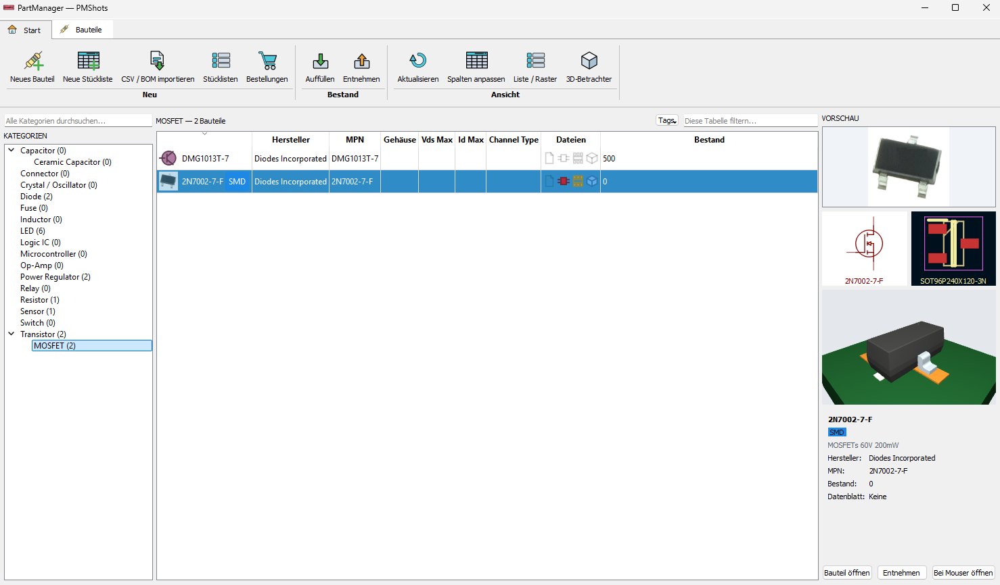

# PartManager


A desktop inventory manager for electronic components. PartManager keeps track of
which parts are in stock, stores their datasheets, photos, KiCad symbols,
footprints and 3D models, builds partlists from BOMs, and orders missing parts
through the Mouser API.

The project is split into a reusable C++/Qt library (`core/`) and a Qt Widgets
desktop application built on top of it (`examples/PartManagerApp/`).



## Table of contents

- [Features](#features)
- [Requirements](#requirements)
- [Building](#building)
- [Running](#running)
- [Database layout](#database-layout)
- [Configuration](#configuration)
  - [FreeCAD (STEP model previews)](#freecad-step-model-previews)
  - [Mouser API keys](#mouser-api-keys)
- [Testing](#testing)
- [Project structure](#project-structure)
- [Documentation](#documentation)
- [License](#license)

## Features

### Component database

Parts are organised in a tree of type templates such as Resistor, MOSFET or
Logic IC. A template defines the attributes a part of that type has and the files
it can carry, and templates inherit from each other, so *Ceramic Capacitor*
receives everything *Capacitor* defines plus its own additions.

Attribute values accept engineering notation. `4k7`, `4.7k`, `4,7k` and `4700`
are parsed to the same value, and searches compare against the parsed number
rather than the text.

### Stock tracking

Restocks and take-outs are recorded as individual transactions, and the current
count is derived from that log. A take-out records whether the parts were used in
a build or lost.

### Tags

Tags group parts across the category tree and are organised in two levels.
Categories such as *Bus protocols*, *PCB placement*, *Lifecycle*, *Voltage
domain* and *Handling* hold related tags, and each category's tags are rendered
as shades of a single colour.

The tag filter combines selections with OR inside a category and AND across
categories.

### Search

A single filter box supports free text, tag terms and attribute comparisons:

```
1k5                     free text across name, MPN, manufacturer, description
"power supply"          quoted text, spaces included
resistance>1k           attribute comparison (= != < <= > >=)
voltage<=25V
tag:SMD                 parts carrying a tag
tag:"Do not use"        tag names containing spaces
tag:I2C,SPI             any of these tags
tag:I2C,SPI tag:SMD     (I2C or SPI) and SMD
```

Invalid queries produce an empty result and a marked input field.

### Partlists and orders

Partlists can be created manually or imported from a BOM or CSV file with
configurable column mapping. PartManager calculates the shortfall against current
stock and stages those quantities into a Mouser cart. Orders are tracked until
arrival, and observed prices are stored as history.

### KiCad integration

PartManager generates one `.kicad_sym` symbol library and one `.pretty` footprint
folder per category, along with the matching library tables. Symbols edited
inside KiCad are detected and preserved rather than overwritten on the next
generation run.

### 3D models

Parts can carry a 3D model. OBJ, PLY, STL and glTF files are rendered directly.
STEP files are tessellated into a cached mesh in the background and rendered from
that cache, with per-solid colours read from the STEP file. Models are displayed
on a rendered PCB using the part's footprint.

### Additional

- Scheduled database snapshots with a configurable retention count.
- Settings for language, theme, storage locations and backups.
- User interface available in English and German.

## Requirements

| Component | Version | Required |
|---|---|---|
| Windows | 10 / 11 | Yes |
| MSVC | 2019 or newer | Yes |
| CMake | 3.20 or newer | Yes |
| Ninja | bundled with Visual Studio | Yes |
| Qt | 5.15.2 (`Core`, `Gui`, `Network`, `Widgets`, `3DCore`, `3DRender`, `3DInput`, `3DExtras`) | Yes |
| FreeCAD | 1.x | Optional, for STEP previews |
| Mouser API keys | — | Optional, for search and ordering |

The library itself is portable C++17; the build scripts are Windows-specific.

Third-party libraries are downloaded automatically during CMake configuration and
require no manual setup: `AppSettings`, `Logger`, `RibbonWidget`, `SQLiteWrapper`
and `UnitTest` (all from KROIA), plus `easy_profiler` for profiling builds.

## Building

```bat
git clone https://github.com/KROIA/PartManager.git
cd PartManager
build.bat x64-Debug
```

`build.bat` locates and initialises the Visual Studio environment automatically,
so no developer command prompt is needed.

| Command | Description |
|---|---|
| `build.bat` | Build `x64-Debug` and `x64-Release` |
| `build.bat x64-Release` | Build a single preset |
| `build.bat list` | List available CMake presets |
| `build.bat clean` | Remove build output, keep the dependency cache |
| `build.bat clean-deps` | Remove dependency build directories, keep sources |
| `build.bat clean-all` | Remove everything under `build\` and `installation\` |
| `build.bat help` | Show all commands |

Build artifacts are installed to `installation\bin\`.

## Running

```bat
installation\bin\PartManagerApp.exe
```

The database selector opens first. To open a database directly, pass its `.pmdb`
file as an argument:

```bat
installation\bin\PartManagerApp.exe "C:\path\to\MyStock\MyStock.pmdb"
```

Databases created by an older version are migrated automatically on open.
Databases created by a newer version are rejected rather than partially read.

## Database layout

A PartManager database is a directory:

```
MyStock/
├── MyStock.pmdb        Descriptor file (JSON): schema version, timestamps
├── partmanager.db      SQLite database
├── filestore/          Datasheets, images, KiCad files, 3D models, mesh cache
├── kicad_libs/         Generated KiCad symbol and footprint libraries
├── backups/            Scheduled snapshots
└── README.md           Free-text description, editable outside the application
```

## Configuration

### FreeCAD (STEP model previews)

Qt3D loads OBJ, PLY, STL and glTF directly. STEP files (`.step`, `.stp`) use
boundary representation rather than meshes and require a CAD kernel to be
converted before they can be rendered. PartManager uses FreeCAD's command-line
binary for this conversion and caches the result.

FreeCAD is optional. Without it, STEP files can still be attached to parts,
stored and exported to KiCad libraries; only the 3D preview is unavailable, and
the preview panel reports which locations were searched.

1. Install [FreeCAD](https://www.freecad.org/) (tested with 1.1.3).
2. No further configuration is required.

PartManager searches the following locations in order:

1. The path in the `PARTMANAGER_STEP_CONVERTER` environment variable
2. `C:\Program Files\FreeCAD *\bin\FreeCADCmd.exe` and the equivalent under
   `Program Files (x86)`
3. `FreeCADCmd` on `PATH`

To use a non-standard installation path:

```bat
setx PARTMANAGER_STEP_CONVERTER "D:\Tools\FreeCAD\bin\FreeCADCmd.exe"
```

Conversion runs in the background for all unconverted models while the
application is open. The cache is keyed by a hash of the STEP file contents, so
replacing a model triggers a new conversion and parts sharing a model share one
cached mesh.

### Mouser API keys

Mouser features require API keys. Keys are read from environment variables only.
They are not stored in the settings file, not written to disk and not logged, and
the settings dialog contains no field for them.

Two separate keys are required, and they are not interchangeable.

| Environment variable | Mouser API | Enables |
|---|---|---|
| `MOUSER_SEARCH_API` | Search API | Keyword and part-number search, creating parts from an MPN or product link, price and stock lookup |
| `MOUSER_CART_API` | Cart API | Staging carts from partlist shortfalls, order tracking |

**Obtaining the keys**

1. Sign in at [mouser.com/api-hub](https://www.mouser.com/api-hub/) with a Mouser
   account.
2. Request a **Search API** key. Approval is usually immediate and the key is
   shown in the API hub.
3. Request a **Cart API** key separately if ordering features are needed.

**Setting the keys**

System-wide, for all users:

```bat
setx MOUSER_SEARCH_API "your-search-key" /M
setx MOUSER_CART_API   "your-cart-key"   /M
```

For the current user only, omit `/M`. For a single PowerShell session:

```powershell
$env:MOUSER_SEARCH_API = "your-search-key"
```

> **Note**
> `setx` does not affect already-running processes or open terminals. Restart
> PartManager from a new terminal after setting the variables.

If a key is missing, the affected screens report which environment variable is
required. All other functionality remains available.

## Testing

```bat
installation\bin\ExampleTest.exe
```

All test suites are compiled into a single executable. The suite includes GUI
tests that create and drive real dialogs, so application windows appear while it
runs. The process exits with `0` on success.

## Project structure

```
core/                     Library: no widgets, no application logic
├── database/             Database handle, schema migration, registry
├── domain/               Plain data types (Part, PartType, Tag, ...)
├── persistence/          Repositories; all SQL lives here
├── units/                SI value parsing
├── search/               Filter grammar and query building
├── filestore/            Attachment storage
├── mouser/               Search API and Cart API clients
├── kicad/                Library generation, symbol/footprint geometry
├── easyeda/              EasyEDA symbol and footprint import
├── import/               BOM and CSV parsing
├── model3d/              Format detection, STEP conversion, STEP colours
├── backup/               Snapshots and retention
└── settings/             Preferences

examples/
├── PartManagerApp/       Desktop application (ui, widgets, controllers, services)
└── PartImport/           Console CSV importer

unittests/                Test suites
docs/design/              Architecture specification, mockups, prototype
```

## Documentation

- `docs/design/ARCHITECTURE.md` — full specification. Sections are numbered and
  referenced from the source code.
- `docs/design/mockups/` — design mockups for all 14 screens.
- `docs/design/prototype/index.html` — click-through prototype.

## License

This repository does not yet include a `LICENSE` file. Default copyright applies,
which means the code may not be reused without permission from the author.

Built on the [KROIA CMake project template](https://github.com/KROIA).
